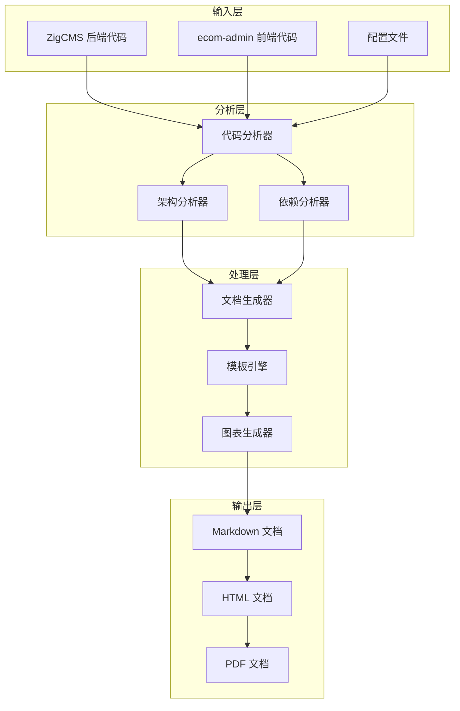

# Design Document: ZigCMS 前后端知识文档生成系统

## Overview

本设计文档描述了 ZigCMS 前后端知识文档生成系统的架构设计。该系统通过分析 ZigCMS 后端（Zig 语言 + 整洁架构）和 ecom-admin 前端（Vue 3 + Arco Design）的代码结构，自动生成全面的技术文档，帮助开发者快速理解项目架构、技术栈和开发规范。

系统采用模块化设计，包含代码分析器、文档生成器、模板引擎和输出管理器四个核心组件。

## Architecture

### 系统架构图



### 核心组件

1. **代码分析器 (Code Analyzer)**
   - 解析 Zig 和 TypeScript 源代码
   - 提取模块、类、函数、接口信息
   - 识别架构模式和设计模式

2. **架构分析器 (Architecture Analyzer)**
   - 分析整洁架构分层
   - 识别依赖关系
   - 生成架构图

3. **文档生成器 (Documentation Generator)**
   - 根据分析结果生成文档内容
   - 应用文档模板
   - 生成代码示例

4. **模板引擎 (Template Engine)**
   - 管理文档模板
   - 渲染文档内容
   - 支持自定义模板

## Components and Interfaces

### 1. 代码分析器 (Code Analyzer)


#### 接口定义

```zig
pub const CodeAnalyzer = struct {
    allocator: Allocator,
    config: AnalyzerConfig,
    
    pub const AnalyzerConfig = struct {
        source_paths: []const []const u8,
        exclude_patterns: []const []const u8,
        language: Language,
    };
    
    pub const Language = enum {
        Zig,
        TypeScript,
        Vue,
    };
    
    pub fn init(allocator: Allocator, config: AnalyzerConfig) !*CodeAnalyzer;
    pub fn deinit(self: *CodeAnalyzer) void;
    pub fn analyze(self: *CodeAnalyzer) !AnalysisResult;
};

pub const AnalysisResult = struct {
    modules: []Module,
    dependencies: []Dependency,
    architecture: ArchitectureInfo,
};
```

#### 职责

- 扫描指定目录的源代码文件
- 解析代码结构（模块、类、函数、接口）
- 提取注释和文档字符串
- 识别导入/导出关系

### 2. 架构分析器 (Architecture Analyzer)

#### 接口定义

```zig
pub const ArchitectureAnalyzer = struct {
    allocator: Allocator,
    
    pub fn init(allocator: Allocator) !*ArchitectureAnalyzer;
    pub fn deinit(self: *ArchitectureAnalyzer) void;
    pub fn analyzeArchitecture(self: *ArchitectureAnalyzer, result: AnalysisResult) !ArchitectureDoc;
};

pub const ArchitectureDoc = struct {
    layers: []Layer,
    dependencies: []LayerDependency,
    patterns: []DesignPattern,
};

pub const Layer = struct {
    name: []const u8,
    path: []const u8,
    modules: []Module,
    responsibilities: []const u8,
};
```

#### 职责

- 识别整洁架构的五个层次
- 分析层间依赖关系
- 检测架构违规（如反向依赖）
- 生成架构可视化数据

### 3. 文档生成器 (Documentation Generator)

#### 接口定义

```zig
pub const DocumentationGenerator = struct {
    allocator: Allocator,
    template_engine: *TemplateEngine,
    
    pub fn init(allocator: Allocator, template_engine: *TemplateEngine) !*DocumentationGenerator;
    pub fn deinit(self: *DocumentationGenerator) void;
    pub fn generate(self: *DocumentationGenerator, arch_doc: ArchitectureDoc) ![]Document;
};

pub const Document = struct {
    title: []const u8,
    content: []const u8,
    format: DocumentFormat,
    metadata: DocumentMetadata,
};

pub const DocumentFormat = enum {
    Markdown,
    HTML,
    PDF,
};
```

#### 职责

- 根据分析结果生成文档内容
- 应用文档模板
- 生成代码示例
- 创建图表和可视化

### 4. 模板引擎 (Template Engine)

#### 接口定义

```zig
pub const TemplateEngine = struct {
    allocator: Allocator,
    templates: std.StringHashMap(Template),
    
    pub fn init(allocator: Allocator) !*TemplateEngine;
    pub fn deinit(self: *TemplateEngine) void;
    pub fn loadTemplate(self: *TemplateEngine, name: []const u8, path: []const u8) !void;
    pub fn render(self: *TemplateEngine, template_name: []const u8, data: anytype) ![]const u8;
};

pub const Template = struct {
    name: []const u8,
    content: []const u8,
    variables: []Variable,
};
```

#### 职责

- 加载和管理文档模板
- 渲染模板内容
- 支持变量替换和条件渲染
- 支持自定义模板

## Data Models

### 模块信息 (Module)

```zig
pub const Module = struct {
    name: []const u8,
    path: []const u8,
    layer: LayerType,
    exports: []Export,
    imports: []Import,
    documentation: ?[]const u8,
};

pub const LayerType = enum {
    API,
    Application,
    Domain,
    Infrastructure,
    Shared,
    Frontend,
};
```

### 依赖关系 (Dependency)

```zig
pub const Dependency = struct {
    from: []const u8,
    to: []const u8,
    type: DependencyType,
};

pub const DependencyType = enum {
    Import,
    Inheritance,
    Composition,
    Usage,
};
```

### 文档元数据 (DocumentMetadata)

```zig
pub const DocumentMetadata = struct {
    version: []const u8,
    generated_at: i64,
    author: []const u8,
    project_name: []const u8,
    description: []const u8,
};
```


## Correctness Properties

*A property is a characteristic or behavior that should hold true across all valid executions of a system—essentially, a formal statement about what the system should do. Properties serve as the bridge between human-readable specifications and machine-verifiable correctness guarantees.*

### Property Reflection

After analyzing all acceptance criteria, I identified several opportunities to consolidate redundant properties:

1. **Documentation Completeness Properties**: Many criteria (1.2, 2.2, 3.2, 4.2, etc.) test that generated documentation contains specific required sections. These can be consolidated into a single comprehensive property that validates documentation completeness based on content type.

2. **Format Validation Properties**: Criteria 9.1, 9.3, 9.4 all test output format correctness. These can be combined into a single property that validates all format requirements.

3. **Content Inclusion Properties**: Multiple criteria test that specific content is included in documentation (1.4, 2.3, 2.4, 3.4, etc.). These can be consolidated into properties that validate content inclusion based on analysis results.

### Core Properties

#### Property 1: Architecture Layer Recognition

*For any* valid ZigCMS backend codebase, when the system analyzes the code structure, it should correctly identify all five layers of Clean Architecture (API, Application, Domain, Infrastructure, Shared) based on directory structure and module organization.

**Validates: Requirements 1.1**

#### Property 2: Documentation Completeness

*For any* generated documentation of type T (architecture, ORM, database, frontend, etc.), the documentation should contain all required sections specific to that type, including descriptions, examples, and diagrams where applicable.

**Validates: Requirements 1.2, 2.2, 3.2, 4.2, 5.2, 6.2, 7.2, 8.2**

#### Property 3: Dependency Visualization

*For any* architecture analysis result containing layer dependencies, the generated documentation should include a valid Mermaid diagram that accurately represents all dependency relationships between layers.

**Validates: Requirements 1.3**

#### Property 4: Code Example Syntax Validity

*For any* generated code example in language L (Zig, TypeScript, Vue), the example code should be syntactically valid and compilable/parsable by the respective language toolchain.

**Validates: Requirements 1.5**

#### Property 5: API Pattern Recognition

*For any* codebase containing QueryBuilder or similar API patterns, the system should identify all public methods and their signatures, including chained methods like where(), whereIn(), whereRaw().

**Validates: Requirements 2.1**

#### Property 6: Database Driver Detection

*For any* codebase with database connectivity, the system should correctly identify all database drivers (MySQL, SQLite, PostgreSQL) based on import statements and configuration files.

**Validates: Requirements 3.1**

#### Property 7: Frontend Technology Stack Recognition

*For any* Vue 3 frontend codebase, the system should identify the core technology stack (Vue 3, Pinia, Vue Router, UI framework) by analyzing package.json and import statements.

**Validates: Requirements 4.1**

#### Property 8: Mock System Detection

*For any* frontend codebase with mock data, the system should identify mock data files, mock configuration, and the switching mechanism between mock and real APIs.

**Validates: Requirements 5.1**

#### Property 9: RESTful API Pattern Recognition

*For any* backend API codebase, the system should identify RESTful endpoints including HTTP methods, paths, request parameters, and response structures.

**Validates: Requirements 6.1**

#### Property 10: Authentication Mechanism Detection

*For any* codebase with authentication, the system should identify the authentication mechanism (JWT, OAuth, etc.) and extract key components like token generation, validation, and storage.

**Validates: Requirements 7.1**

#### Property 11: Dependency Extraction

*For any* project with dependency management files (build.zig.zon, package.json), the system should extract all dependencies with their versions and categorize them as required or optional.

**Validates: Requirements 8.1**

#### Property 12: Output Format Validity

*For any* generated documentation, the output should be valid Markdown with proper syntax for headings, code blocks (with language tags), lists, and links, and should be convertible to HTML and PDF without errors.

**Validates: Requirements 9.1, 9.3, 9.4, 10.5**

#### Property 13: Documentation Structure Consistency

*For any* set of generated documents, they should follow a consistent organizational structure with categorization (backend, frontend, API, guides) and include a navigable table of contents with anchor links.

**Validates: Requirements 9.2, 9.5**

#### Property 14: Documentation Regeneration Idempotency

*For any* unchanged codebase, running the documentation generator multiple times should produce identical content (excluding timestamps and version metadata).

**Validates: Requirements 10.1**

#### Property 15: Metadata Inclusion

*For any* generated document, it should include complete metadata (generation timestamp, version, project name, author) in a consistent format.

**Validates: Requirements 10.2**

### Edge Case Properties

#### Property 16: Empty Codebase Handling

*For any* empty or minimal codebase, the system should generate valid documentation with appropriate warnings about missing components rather than failing or producing invalid output.

**Validates: Requirements 1.1, 3.1, 4.1 (edge case)**

#### Property 17: Mixed Language Handling

*For any* project containing multiple languages (Zig + TypeScript + Vue), the system should correctly analyze each language independently and generate integrated documentation that covers all components.

**Validates: Requirements 1.1, 4.1 (edge case)**


## Error Handling

### Error Types

```zig
pub const DocumentationError = error{
    // 分析错误
    InvalidSourcePath,
    UnsupportedLanguage,
    ParseError,
    AnalysisTimeout,
    
    // 生成错误
    TemplateNotFound,
    RenderError,
    InvalidTemplate,
    
    // 输出错误
    OutputPathNotWritable,
    FormatConversionError,
    FileWriteError,
    
    // 配置错误
    InvalidConfiguration,
    MissingRequiredConfig,
};
```

### Error Handling Strategy

1. **分析阶段错误**
   - 文件不存在：记录警告，跳过该文件
   - 解析失败：记录错误详情，继续处理其他文件
   - 超时：中断当前分析，返回部分结果

2. **生成阶段错误**
   - 模板缺失：使用默认模板或返回错误
   - 渲染失败：记录错误，生成错误报告文档
   - 数据不完整：使用占位符，标记缺失内容

3. **输出阶段错误**
   - 写入失败：重试机制（最多3次）
   - 格式转换失败：回退到 Markdown 格式
   - 权限问题：提示用户并返回详细错误

### 错误恢复机制

```zig
pub fn generateDocumentation(self: *DocumentationGenerator, config: Config) ![]Document {
    var documents = std.ArrayList(Document).init(self.allocator);
    errdefer documents.deinit();
    
    // 分析阶段
    const analysis_result = self.analyzer.analyze(config.source_paths) catch |err| {
        std.log.err("分析失败: {}", .{err});
        return err;
    };
    
    // 生成阶段（部分失败不影响整体）
    for (analysis_result.modules) |module| {
        const doc = self.generateModuleDoc(module) catch |err| {
            std.log.warn("模块 {} 文档生成失败: {}", .{module.name, err});
            continue;  // 跳过失败的模块，继续处理其他模块
        };
        try documents.append(doc);
    }
    
    return documents.toOwnedSlice();
}
```

## Testing Strategy

### 测试方法

本项目采用**双重测试策略**：单元测试验证具体功能，属性测试验证通用正确性。

#### 单元测试

单元测试专注于：
- 特定输入的预期输出
- 边界条件和错误情况
- 集成点验证

示例：
```zig
test "CodeAnalyzer识别Zig模块" {
    const allocator = testing.allocator;
    var analyzer = try CodeAnalyzer.init(allocator, .{
        .source_paths = &.{"test_data/zig_project"},
        .exclude_patterns = &.{},
        .language = .Zig,
    });
    defer analyzer.deinit();
    
    const result = try analyzer.analyze();
    defer result.deinit();
    
    try testing.expect(result.modules.len > 0);
    try testing.expectEqualStrings("main", result.modules[0].name);
}

test "文档生成器处理空输入" {
    const allocator = testing.allocator;
    var generator = try DocumentationGenerator.init(allocator, template_engine);
    defer generator.deinit();
    
    const empty_arch = ArchitectureDoc{
        .layers = &.{},
        .dependencies = &.{},
        .patterns = &.{},
    };
    
    const docs = try generator.generate(empty_arch);
    defer allocator.free(docs);
    
    // 应该生成包含警告的有效文档
    try testing.expect(docs.len > 0);
    try testing.expect(std.mem.indexOf(u8, docs[0].content, "警告") != null);
}
```

#### 属性测试

属性测试验证跨所有输入的通用属性，使用 Zig 的测试框架配合随机数据生成。

配置：
- 每个属性测试运行 **100 次迭代**
- 使用随机种子确保可重现性
- 标记格式：`// Feature: frontend-backend-knowledge-doc, Property N: [property text]`

示例：
```zig
test "Property 1: Architecture Layer Recognition" {
    // Feature: frontend-backend-knowledge-doc, Property 1: Architecture Layer Recognition
    const allocator = testing.allocator;
    var prng = std.rand.DefaultPrng.init(0);
    const random = prng.random();
    
    var i: usize = 0;
    while (i < 100) : (i += 1) {
        // 生成随机的项目结构
        const project = try generateRandomProject(allocator, random);
        defer project.deinit();
        
        var analyzer = try CodeAnalyzer.init(allocator, .{
            .source_paths = &.{project.path},
            .exclude_patterns = &.{},
            .language = .Zig,
        });
        defer analyzer.deinit();
        
        const result = try analyzer.analyze();
        defer result.deinit();
        
        // 验证：应该识别所有存在的层
        const expected_layers = project.getExpectedLayers();
        for (expected_layers) |expected| {
            var found = false;
            for (result.architecture.layers) |layer| {
                if (std.mem.eql(u8, layer.name, expected)) {
                    found = true;
                    break;
                }
            }
            try testing.expect(found);
        }
    }
}

test "Property 12: Output Format Validity" {
    // Feature: frontend-backend-knowledge-doc, Property 12: Output Format Validity
    const allocator = testing.allocator;
    var prng = std.rand.DefaultPrng.init(0);
    const random = prng.random();
    
    var i: usize = 0;
    while (i < 100) : (i += 1) {
        // 生成随机的文档内容
        const arch_doc = try generateRandomArchDoc(allocator, random);
        defer arch_doc.deinit();
        
        var generator = try DocumentationGenerator.init(allocator, template_engine);
        defer generator.deinit();
        
        const docs = try generator.generate(arch_doc);
        defer allocator.free(docs);
        
        for (docs) |doc| {
            // 验证 Markdown 格式
            try validateMarkdownSyntax(doc.content);
            
            // 验证代码块有语言标签
            try validateCodeBlocks(doc.content);
            
            // 验证可以转换为 HTML
            const html = try convertToHTML(allocator, doc.content);
            defer allocator.free(html);
            try testing.expect(html.len > 0);
        }
    }
}
```

### 测试数据生成

为属性测试创建随机数据生成器：

```zig
fn generateRandomProject(allocator: Allocator, random: std.rand.Random) !TestProject {
    const layer_count = random.intRangeAtMost(usize, 3, 5);
    var layers = std.ArrayList([]const u8).init(allocator);
    
    const possible_layers = [_][]const u8{ "api", "application", "domain", "infrastructure", "shared" };
    var i: usize = 0;
    while (i < layer_count) : (i += 1) {
        const layer = possible_layers[random.intRangeAtMost(usize, 0, possible_layers.len - 1)];
        try layers.append(layer);
    }
    
    return TestProject{
        .allocator = allocator,
        .path = try createTempProjectStructure(allocator, layers.items),
        .layers = try layers.toOwnedSlice(),
    };
}

fn generateRandomArchDoc(allocator: Allocator, random: std.rand.Random) !ArchitectureDoc {
    const layer_count = random.intRangeAtMost(usize, 1, 5);
    var layers = try allocator.alloc(Layer, layer_count);
    
    for (layers, 0..) |*layer, i| {
        layer.* = Layer{
            .name = try std.fmt.allocPrint(allocator, "Layer{d}", .{i}),
            .path = try std.fmt.allocPrint(allocator, "src/layer{d}", .{i}),
            .modules = &.{},
            .responsibilities = "Random responsibilities",
        };
    }
    
    return ArchitectureDoc{
        .layers = layers,
        .dependencies = &.{},
        .patterns = &.{},
    };
}
```

### 测试覆盖率目标

- 单元测试：覆盖所有公共 API 和边界条件
- 属性测试：覆盖所有 17 个正确性属性
- 集成测试：覆盖完整的文档生成流程
- 目标覆盖率：> 85%

### 持续集成

```yaml
# .github/workflows/test.yml
name: Test Documentation Generator

on: [push, pull_request]

jobs:
  test:
    runs-on: ubuntu-latest
    steps:
      - uses: actions/checkout@v2
      - name: Setup Zig
        uses: goto-bus-stop/setup-zig@v2
        with:
          version: 0.15.0
      - name: Run Tests
        run: zig build test
      - name: Run Property Tests
        run: zig build test-properties
```

## Implementation Notes

### 技术选型

1. **代码解析**
   - Zig: 使用 `std.zig.parse` 和 `std.zig.Ast`
   - TypeScript: 使用 TypeScript Compiler API
   - Vue: 使用 `@vue/compiler-sfc`

2. **模板引擎**
   - 使用 Mustache 模板语法
   - 支持变量替换、条件渲染、循环

3. **图表生成**
   - Mermaid: 用于架构图、流程图
   - ASCII Art: 用于简单图表

4. **格式转换**
   - Markdown → HTML: 使用 `markdown-it`
   - HTML → PDF: 使用 `puppeteer` 或 `wkhtmltopdf`

### 性能考虑

1. **并行分析**
   - 使用多线程并行分析不同模块
   - 使用 Arena Allocator 批量分配内存

2. **缓存机制**
   - 缓存解析结果，避免重复分析
   - 使用文件哈希检测变化

3. **增量生成**
   - 只重新生成变化的文档
   - 保留未变化文档的缓存

### 扩展性设计

1. **插件系统**
   - 支持自定义分析器
   - 支持自定义模板
   - 支持自定义输出格式

2. **配置化**
   - 通过配置文件定制文档内容
   - 支持多语言文档生成
   - 支持主题定制

## Deployment Considerations

### 使用方式

1. **命令行工具**
```bash
# 生成所有文档
zig-doc-gen --source ./zigcms --output ./docs

# 只生成后端文档
zig-doc-gen --source ./zigcms --output ./docs --type backend

# 指定模板
zig-doc-gen --source ./zigcms --output ./docs --template custom.mustache
```

2. **集成到构建流程**
```zig
// build.zig
const doc_gen = b.addExecutable(.{
    .name = "doc-gen",
    .root_source_file = .{ .path = "tools/doc_gen.zig" },
});

const doc_step = b.step("docs", "Generate documentation");
doc_step.dependOn(&doc_gen.step);
```

3. **CI/CD 集成**
```yaml
- name: Generate Documentation
  run: zig build docs
- name: Deploy to GitHub Pages
  uses: peaceiris/actions-gh-pages@v3
  with:
    github_token: ${{ secrets.GITHUB_TOKEN }}
    publish_dir: ./docs
```

### 文档发布

1. **GitHub Pages**
   - 自动部署到 `gh-pages` 分支
   - 使用 Jekyll 或静态站点生成器

2. **文档网站**
   - 使用 VuePress 或 Docusaurus
   - 支持搜索和版本切换

3. **离线文档**
   - 生成 PDF 供下载
   - 打包为离线 HTML

## Future Enhancements

1. **交互式文档**
   - 代码示例可在线运行
   - 架构图可交互探索

2. **多语言支持**
   - 中英文文档自动生成
   - 支持更多编程语言

3. **AI 辅助**
   - 使用 AI 生成文档描述
   - 自动补充缺失的文档

4. **版本对比**
   - 文档版本历史
   - 变更高亮显示
