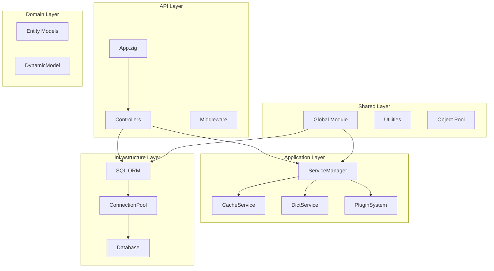

# Design Document: ZigCMS Optimization

## Overview

本设计文档描述 ZigCMS 项目的全面优化方案，包括内存安全修复、企业级项目结构优化、ORM 功能增强、服务模块优化以及动态 CRUD 功能实现。

### Goals

1. 消除所有已识别的内存泄漏风险
2. 确保项目结构符合企业级工程化标准
3. 提供便捷、安全的 ORM API
4. 优化服务模块的性能和可维护性
5. 实现运行时动态表操作能力

### Non-Goals

- 更换数据库驱动或 ORM 框架
- 重写整个项目架构
- 添加新的业务功能

## Architecture



## Components and Interfaces

### 1. Memory-Safe ORM Components

#### 1.1 Enhanced ModelQuery

```zig
pub fn ModelQuery(comptime T: type) type {
    return struct {
        const Self = @This();
        
        db: *Database,
        allocator: Allocator,
        where_clauses: std.ArrayListUnmanaged([]const u8),
        order_clauses: std.ArrayListUnmanaged([]const u8),
        join_clauses: std.ArrayListUnmanaged([]const u8),
        // ... other fields
        
        pub fn deinit(self: *Self) void {
            // Free all allocated clause strings
            for (self.where_clauses.items) |clause| {
                self.allocator.free(clause);
            }
            self.where_clauses.deinit(self.allocator);
            
            for (self.order_clauses.items) |clause| {
                self.allocator.free(clause);
            }
            self.order_clauses.deinit(self.allocator);
            
            for (self.join_clauses.items) |clause| {
                self.allocator.free(clause);
            }
            self.join_clauses.deinit(self.allocator);
        }
        
        // Fluent API methods return *Self
        pub fn where(self: *Self, field: []const u8, op: []const u8, value: anytype) *Self {
            // ... implementation
            return self;
        }
    };
}
```

#### 1.2 Model List Wrapper

```zig
pub const List = struct {
    allocator: Allocator,
    data: []T,
    
    pub fn items(self: *const List) []T {
        return self.data;
    }
    
    pub fn deinit(self: *List) void {
        freeModels(self.allocator, self.data);
        self.data = &.{};
    }
};
```

### 2. Dynamic CRUD System

#### 2.1 DynamicModel Structure

```zig
pub const DynamicModel = struct {
    const Self = @This();
    
    allocator: Allocator,
    table_name: []const u8,
    schema: TableSchema,
    fields: std.StringHashMapUnmanaged(FieldValue),
    
    pub const FieldValue = union(enum) {
        string: []const u8,
        integer: i64,
        float: f64,
        boolean: bool,
        null_value: void,
    };
    
    pub const ColumnInfo = struct {
        name: []const u8,
        data_type: DataType,
        is_nullable: bool,
        is_primary_key: bool,
        default_value: ?[]const u8,
    };
    
    pub const TableSchema = struct {
        columns: []ColumnInfo,
        primary_key: ?[]const u8,
    };
    
    pub fn init(allocator: Allocator, table_name: []const u8) !Self;
    pub fn deinit(self: *Self) void;
    pub fn loadSchema(self: *Self, db: *Database) !void;
    pub fn set(self: *Self, field: []const u8, value: FieldValue) !void;
    pub fn get(self: *const Self, field: []const u8) ?FieldValue;
};
```

#### 2.2 DynamicCrud Controller

```zig
pub const DynamicCrud = struct {
    const Self = @This();
    
    allocator: Allocator,
    db: *Database,
    schema_cache: std.StringHashMapUnmanaged(DynamicModel.TableSchema),
    
    pub fn init(allocator: Allocator, db: *Database) Self;
    pub fn deinit(self: *Self) void;
    
    // Core CRUD operations
    pub fn list(self: *Self, table_name: []const u8, options: ListOptions) !DynamicResultSet;
    pub fn get(self: *Self, table_name: []const u8, id: i64) !?DynamicModel;
    pub fn create(self: *Self, table_name: []const u8, data: anytype) !i64;
    pub fn update(self: *Self, table_name: []const u8, id: i64, data: anytype) !u64;
    pub fn delete(self: *Self, table_name: []const u8, ids: []const i64) !u64;
    
    // Schema discovery
    pub fn getSchema(self: *Self, table_name: []const u8) !DynamicModel.TableSchema;
    pub fn validateField(self: *Self, table_name: []const u8, field: []const u8) !bool;
};
```

### 3. Enhanced Cache Service

```zig
pub const CacheService = struct {
    allocator: Allocator,
    cache: std.StringHashMapUnmanaged(CacheItem),
    mutex: std.Thread.Mutex,
    
    const CacheItem = struct {
        value: []u8,
        expiry: u64,
        created_at: u64,
        
        pub fn deinit(self: *const CacheItem, allocator: Allocator) void {
            allocator.free(self.value);
        }
    };
    
    pub fn set(self: *CacheService, key: []const u8, value: []const u8, ttl: ?u64) !void {
        self.mutex.lock();
        defer self.mutex.unlock();
        
        // Remove existing entry if present
        if (self.cache.fetchRemove(key)) |entry| {
            entry.value.deinit(self.allocator);
            self.allocator.free(entry.key);
        }
        
        // Duplicate both key and value
        const key_copy = try self.allocator.dupe(u8, key);
        errdefer self.allocator.free(key_copy);
        
        const value_copy = try self.allocator.dupe(u8, value);
        errdefer self.allocator.free(value_copy);
        
        try self.cache.put(self.allocator, key_copy, .{
            .value = value_copy,
            .expiry = std.time.timestamp() + (ttl orelse self.default_ttl),
            .created_at = std.time.timestamp(),
        });
    }
    
    pub fn deinit(self: *CacheService) void {
        var iter = self.cache.iterator();
        while (iter.next()) |entry| {
            entry.value_ptr.deinit(self.allocator);
            self.allocator.free(entry.key_ptr.*);
        }
        self.cache.deinit(self.allocator);
    }
};
```

### 4. Global Resource Management

```zig
pub fn deinit() void {
    logger.info("global module deinit, cleaning up resources...", .{});
    
    // 1. Plugins (depends on services)
    if (_plugin_system) |ps| {
        ps.shutdown() catch {};
        _allocator.?.destroy(ps);
        _plugin_system = null;
    }
    
    // 2. Service Manager (depends on database)
    if (_service_manager) |sm| {
        sm.deinit();
        _allocator.?.destroy(sm);
        _service_manager = null;
    }
    
    // 3. Database connection
    if (_db) |db| {
        db.deinit();
        _allocator.?.destroy(db);
        _db = null;
    }
    
    // 4. Logger
    logger.deinitDefault();
    
    // 5. Config
    config.deinit();
}
```

## Data Models

### DynamicRow

```zig
pub const DynamicRow = struct {
    allocator: Allocator,
    columns: []const []const u8,
    values: []?[]const u8,
    
    pub fn getString(self: *const DynamicRow, column: []const u8) ?[]const u8 {
        for (self.columns, 0..) |col, i| {
            if (std.mem.eql(u8, col, column)) {
                return self.values[i];
            }
        }
        return null;
    }
    
    pub fn getInt(self: *const DynamicRow, column: []const u8) ?i64 {
        if (self.getString(column)) |str| {
            return std.fmt.parseInt(i64, str, 10) catch null;
        }
        return null;
    }
    
    pub fn deinit(self: *DynamicRow) void {
        for (self.values) |v| {
            if (v) |str| self.allocator.free(str);
        }
        self.allocator.free(self.values);
        self.allocator.free(self.columns);
    }
};
```

### DynamicResultSet

```zig
pub const DynamicResultSet = struct {
    allocator: Allocator,
    rows: []DynamicRow,
    total: u64,
    
    pub fn deinit(self: *DynamicResultSet) void {
        for (self.rows) |*row| {
            row.deinit();
        }
        self.allocator.free(self.rows);
    }
};
```

## Correctness Properties

*A property is a characteristic or behavior that should hold true across all valid executions of a system-essentially, a formal statement about what the system should do. Properties serve as the bridge between human-readable specifications and machine-verifiable correctness guarantees.*

### Property 1: ModelQuery Memory Safety
*For any* ModelQuery instance with any combination of where, order, and join clauses, calling deinit() should free all allocated memory without leaks.
**Validates: Requirements 1.1**

### Property 2: Model List Memory Management
*For any* List wrapper containing any number of models, calling deinit() should free all model string fields and the underlying array.
**Validates: Requirements 1.2, 3.2, 3.3**

### Property 3: Cache Key-Value Independence
*For any* key-value pair stored in CacheService, modifying the original key or value strings should not affect the cached data.
**Validates: Requirements 1.3**

### Property 4: Controller Registry Cleanup
*For any* App instance with any number of registered controllers, calling deinit() should free all controller memory.
**Validates: Requirements 1.6**

### Property 5: SQL Injection Prevention
*For any* string value containing SQL special characters (quotes, semicolons, etc.), the generated SQL should properly escape these characters.
**Validates: Requirements 3.4**

### Property 6: Transaction Rollback on Error
*For any* transaction that encounters an error, all database changes within that transaction should be rolled back.
**Validates: Requirements 3.5**

### Property 7: Connection Pool Retry
*For any* transient connection failure, the connection pool should retry acquisition up to the configured limit before failing.
**Validates: Requirements 3.6**

### Property 8: Model Serialization Round-Trip
*For any* valid model instance, serializing to SQL INSERT, executing, and deserializing should produce an equivalent model.
**Validates: Requirements 3.7, 3.8, 6.1, 6.2, 6.3, 6.4**

### Property 9: Cache Thread Safety
*For any* concurrent cache operations from multiple threads, the cache should maintain data integrity without corruption.
**Validates: Requirements 4.1**

### Property 10: Cache Expiration Cleanup
*For any* set of cache items with various TTLs, cleanupExpired() should remove exactly those items whose TTL has elapsed.
**Validates: Requirements 4.2**

### Property 11: Dynamic Schema Discovery
*For any* valid table name in the database, getSchema() should return accurate column information matching the actual table structure.
**Validates: Requirements 5.1**

### Property 12: Dynamic CRUD Operations
*For any* valid table and field data, dynamic INSERT should create a record, SELECT should retrieve it, UPDATE should modify it, and DELETE should remove it.
**Validates: Requirements 5.3, 5.4, 5.5, 5.6**

### Property 13: Dynamic Field Validation
*For any* field name not in the table schema, validateField() should return false and operations should reject the field.
**Validates: Requirements 5.7**

### Property 14: NULL Value Handling
*For any* NULL value in SQL results, the corresponding Zig optional field should be set to null.
**Validates: Requirements 6.5**

## Error Handling

### Layer-Specific Error Types

```zig
// API Layer Errors
pub const ApiError = error{
    InvalidRequest,
    Unauthorized,
    NotFound,
    ValidationFailed,
    RateLimited,
};

// Application Layer Errors
pub const ServiceError = error{
    CacheError,
    PluginError,
    ConfigurationError,
    DependencyError,
};

// Domain Layer Errors
pub const DomainError = error{
    InvalidEntity,
    BusinessRuleViolation,
    SchemaNotFound,
    FieldNotFound,
};

// Infrastructure Layer Errors
pub const InfraError = error{
    ConnectionFailed,
    ConnectionLost,
    QueryFailed,
    TransactionFailed,
    PoolExhausted,
};
```

### Error Propagation Pattern

```zig
pub fn handleRequest(req: *Request) ApiError!void {
    const data = service.getData() catch |err| switch (err) {
        error.ConnectionFailed => return error.ServiceUnavailable,
        error.NotFound => return error.NotFound,
        else => return error.InternalError,
    };
    // ...
}
```

## Testing Strategy

### Dual Testing Approach

本项目采用单元测试和属性测试相结合的方式：

1. **单元测试**: 验证具体示例和边界情况
2. **属性测试**: 验证在所有有效输入上都应成立的通用属性

### Property-Based Testing Framework

使用 Zig 标准库的测试功能结合自定义生成器实现属性测试：

```zig
const std = @import("std");
const testing = std.testing;

// 自定义生成器
fn generateRandomString(allocator: Allocator, max_len: usize) ![]u8 {
    var prng = std.rand.DefaultPrng.init(@intCast(std.time.nanoTimestamp()));
    const len = prng.random().intRangeAtMost(usize, 1, max_len);
    const str = try allocator.alloc(u8, len);
    for (str) |*c| {
        c.* = prng.random().intRangeAtMost(u8, 32, 126);
    }
    return str;
}

// 属性测试示例
test "Property: SQL escaping prevents injection" {
    const allocator = testing.allocator;
    
    // 运行 100 次随机测试
    for (0..100) |_| {
        const input = try generateRandomString(allocator, 100);
        defer allocator.free(input);
        
        const escaped = try escapeSQL(allocator, input);
        defer allocator.free(escaped);
        
        // 验证：转义后的字符串不应包含未转义的单引号
        var i: usize = 0;
        while (i < escaped.len) : (i += 1) {
            if (escaped[i] == '\'') {
                try testing.expect(i + 1 < escaped.len and escaped[i + 1] == '\'');
                i += 1; // 跳过转义的引号
            }
        }
    }
}
```

### Test Categories

1. **Memory Safety Tests**: 使用 `GeneralPurposeAllocator` 检测内存泄漏
2. **Concurrency Tests**: 多线程并发访问测试
3. **Round-Trip Tests**: 序列化/反序列化一致性测试
4. **Edge Case Tests**: 空值、特殊字符、边界值测试

### Test Configuration

- 每个属性测试运行至少 100 次迭代
- 使用 `testing.allocator` 自动检测内存泄漏
- 测试文件命名: `*_test.zig`
